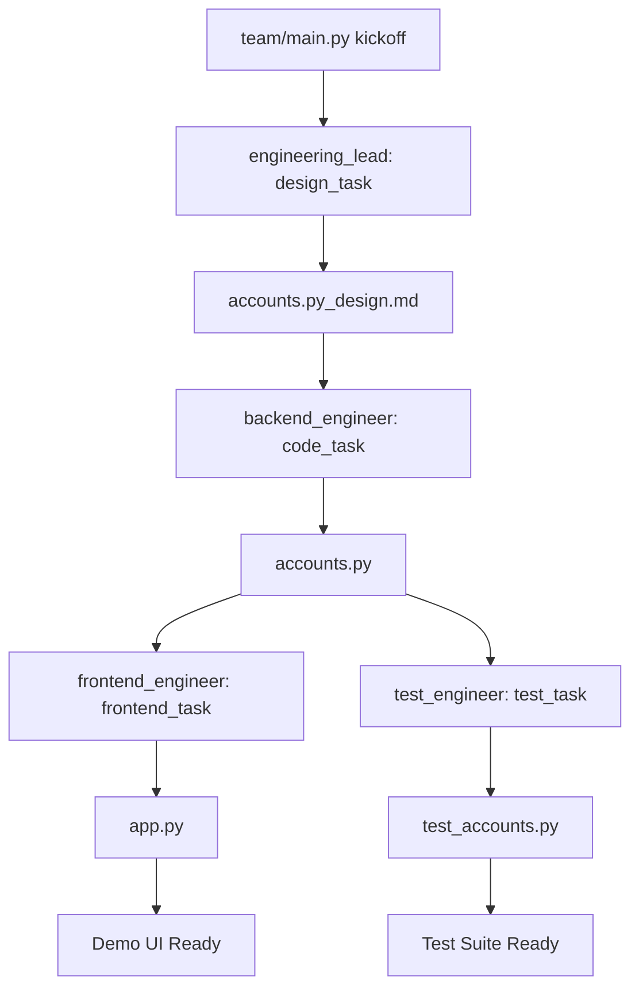
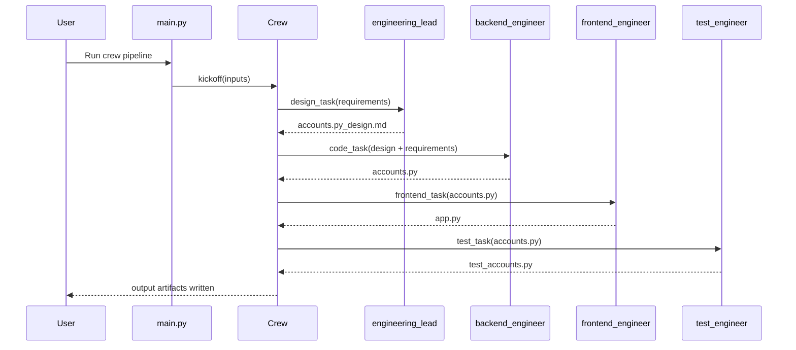

# Company Workspace


This repository contains a CrewAI-powered engineering pipeline that generates backend code, a demo frontend, and tests from high-level product requirements.

## At a Glance

The pipeline in `team/` runs 4 sequential stages:
1. Create design document for a backend module.
2. Implement backend module code.
3. Build a Gradio demo app for the backend.
4. Create unit tests for the backend.

## Repository Structure

```text
company/
├── README.md
├── requirements.txt
└── team/
    ├── AGENTS.md
    ├── README.md
    ├── pyproject.toml
    ├── uv.lock
    ├── .env
    ├── knowledge/
    │   └── user_preference.txt
    ├── output/
    │   ├── accounts.py
    │   ├── accounts.py_design.md
    │   ├── app.py
    │   └── test_accounts.py
    ├── src/
    │   └── team/
    │       ├── __init__.py
    │       ├── crew.py
    │       ├── main.py
    │       ├── config/
    │       │   ├── agents.yaml
    │       │   └── tasks.yaml
    │       └── tools/
    │           ├── __init__.py
    │           └── custom_tool.py
    └── tests/
```

Notes:
- `.venv/` directories at root and `team/` are local environment artifacts.
- `.git/` and `__pycache__/` are intentionally omitted from the tree view above.

## Agent Workflow

| Step | Agent | Input | Output |
|---|---|---|---|
| 1 | `engineering_lead` | Product requirements + module/class names | `output/accounts.py_design.md` |
| 2 | `backend_engineer` | Design document + requirements | `output/accounts.py` |
| 3 | `frontend_engineer` | Generated backend module | `output/app.py` |
| 4 | `test_engineer` | Generated backend module | `output/test_accounts.py` |

## Workflow Chart (Mermaid)



## Agent Interaction Sequence (Mermaid)



## Key Files and Responsibilities

- `requirements.txt`: top-level dependency list (`crewai`, `gradio`).
- `team/pyproject.toml`: project metadata, dependencies, and script entry points.
- `team/src/team/config/agents.yaml`: role/goal/backstory and model config for each agent.
- `team/src/team/config/tasks.yaml`: task definitions, context dependencies, and output files.
- `team/src/team/crew.py`: agent and task wiring with sequential CrewAI process.
- `team/src/team/main.py`: kickoff entrypoint with concrete requirements.
- `team/output/`: generated outputs for backend, design, UI, and tests.

## Quick Start

### 1. Create and activate environment

```bash
python -m venv .venv
source .venv/bin/activate
```

### 2. Install dependencies

Option A (root-level requirements):

```bash
pip install -r requirements.txt
```

Option B (recommended for the CrewAI project):

```bash
cd team
uv sync
```

### 3. Configure API key

Add to `team/.env`:

```env
OPENAI_API_KEY=your_key_here
```

## Run the Pipeline

From `team/`:

```bash
crewai run
```

Alternative:

```bash
python -m team.main
```

Artifacts are generated in `team/output/`.

## Run Generated Tests

From `team/output/`:

```bash
python -m unittest test_accounts.py
```

## Run Generated Demo UI

From `team/output/`:

```bash
python app.py
```

This launches a local Gradio app that exercises the generated `Account` backend.

## Current Generated Use Case

The generated backend currently covers a trading simulation account with:
- account creation and initial deposit
- deposits and withdrawals
- buy/sell operations with safety checks
- holdings and transaction history
- portfolio valuation and profit/loss reporting
- mock price lookup for `AAPL`, `TSLA`, `GOOGL`

## Development Notes

- `team/tests/` exists for additional project-level tests and can be expanded.
- `team/src/team/tools/custom_tool.py` is a starter template for custom tools.
- `team/AGENTS.md` contains CrewAI coding guidelines for AI coding assistants.